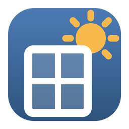

<p align="center">
  
</p>

<h1 align="center">FenCalc2</h1>

<p align="center">
  Fenestration solar-gain calculations for <strong>SANS 10400-XA</strong><br>
  Windows and Linux desktop application · MIT licensed
</p>

---

FenCalc2 is a desktop tool that calculates the window (fenestration) figures needed for a
SANS 10400-XA thermal-compliance calculation: glazing area per window type, the
window-to-floor-area ratio, U-values, solar heat gain for each orientation of the building,
and conductance totals — all delivered as a plain-text report you can paste into your own
documents.

**Who it is for:** architectural professionals, building-energy consultants and students who
already work with SANS 10400-XA.

**What you need to know first:** U-value, SHGC (g-value), window-to-floor-area ratio,
climate zones, and the P and G values used in the shading expression. FenCalc2 performs the
arithmetic — it does not teach the standard. If those terms are unfamiliar, read
**SANS 10400-XA: The design of buildings for thermal comfort** before relying on any output.

> ⚠️ **Verify everything — no liability.** Results are only as good as the data you enter.
> Check every value against SANS 10400-XA and the manufacturer's tested data. The software
> is provided as-is, without warranty of any kind, and the author accepts no liability for
> any decision, loss or damage arising from its use.

## Features

- **Compass plan view** — eight direction tiles around your floor-plan image; tap a tile to
  add a window there, click a window card to edit it.
- **Floor-plan images per floor** — click the centre box, pick a png/jpg/bmp; the app copies
  it into its own data folder.
- **Rotate and mirror** — shift the direction ring with the buttons or the mouse wheel,
  re-anchor it with the Orientation selector, or mirror the whole building left-to-right.
- **Window catalogue** — ranges and window types with glazing/frame U-values and SHGC, plus
  manufacturer-tested overrides.
- **Multi-storey buildings** — add, duplicate, rename and delete floors; per-floor areas and
  plans; copy windows across floors and directions.
- **Editable windows** — change type, size, side, floor, glass, frame, P/G, U and SHGC, then
  Apply Changes.
- **The output** — per-floor report with areas, ratio, constants, solar heat gain per
  direction and conductance totals; copy it to the clipboard and paste into a **monospace
  font** (Consolas / Courier New) so the columns line up.
- Light, dark and five accent themes.

The in-app **Help > Getting Started** guide walks through the whole workflow, including a
worked example of creating a top-hung aluminium range.

## Getting started (short version)

1. **Catalogue** — a fresh install ships with a starter catalogue (7 glazing types, 5 frame
   materials, the climate-zone tables and 5 window ranges with their types). Upgrading from
   the classic FenCalc? Use *Catalogue > Import Old Database* (Windows only).
2. **New project** — *Project > New Project*: client, project, building, climate zone and
   the orientation at the top of your plan. A Ground Floor is created for you.
3. **Plan image** — click the centre box of the compass and pick your drawing.
4. **Line up the building** — Orientation selector, Rotate buttons / mouse wheel, and
   Mirror Building.
5. **Add windows** — tap a compass tile, right-click > *Add Window Here*, or the
   *Add Window…* button.
6. **Edit** — click a window card, change anything, *Apply Changes* (use `Orient` or `Floor`
   to move it).
7. **Copy the output** — *Copy to Clipboard*, paste as plain text in a monospace font.

## Building from source

Requirements: the [.NET 9 SDK](https://dotnet.microsoft.com/download/dotnet/9.0).

```bash
dotnet build FenCalc2.sln        # 0 warnings expected
dotnet run --project FenCalc2.csproj
```

## Publishing a standalone build

Self-contained builds run without the .NET runtime installed:

```powershell
# Windows: produces publish/win-x64 and publish/linux-x64
./publish.ps1
# or one platform only
./publish.ps1 -WindowsOnly
./publish.ps1 -LinuxOnly
```

Or natively on Linux:

```bash
dotnet publish FenCalc2.csproj -c Release -r linux-x64 --self-contained -o publish/linux-x64
./publish/linux-x64/FenCalc2
```

`publish/win-x64/FenCalc2.exe` is the Windows application;
`publish/linux-x64/FenCalc2` is the Linux binary (no installer needed on either — unpack
and run).

> The legacy *Import Old Database* feature uses a Windows-only SQLite component and is
> disabled elsewhere with a status-bar message. Everything else works on both platforms.

## Data and databases

| | |
|---|---|
| **Windows** | `%LOCALAPPDATA%\FenCalc2\Data\FenCalc2.db` (+ `Images\`) |
| **Linux** | `~/.local/share/FenCalc2/Data/FenCalc2.db` (+ `Images/`) |

- The database is a plain SQLite file, **created and migrated automatically the first time
  you start the application** — there is nothing to install or configure, and no admin
  rights are needed.
- It carries **no password**. (The only password in the codebase opens the *old* FenCalc
  database during a legacy import; that file is never distributed.)
- On a fresh install the curated catalogue seed (`Data/seed/catalogue.sql`) is applied
  automatically so the app is usable immediately.
- Your floor-plan images are copied next to the database, so the original files stay where
  they are.
- Set the `FENCALC2_DB_PATH` environment variable to point the application at a different
  database file (used for testing).

## Repository notes

- `LegacySqlite/` holds the codec-enabled net46 `System.Data.SQLite` pair (public domain,
  taken from the original FenCalc application's packages). It is required to build the
  legacy import and must not be removed.
- The logo and exe icon are generated, not hand-edited: `python tools/make_logo.py`
  (needs [Pillow](https://pypi.org/project/Pillow/)).
- The catalogue seed is generated from a curated database with
  `python tools/export_seed.py <db>`.
- No database, floor-plan image or project data is stored in this repository.

## Licence

[MIT](LICENSE) — Copyright (c) 2026 Piet Snyman.

SANS 10400-XA is a publication of the SABS and is not included with or affiliated with this
project.
