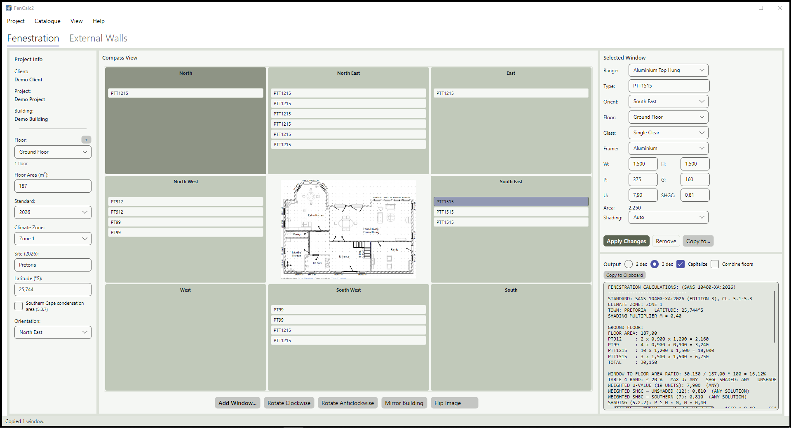
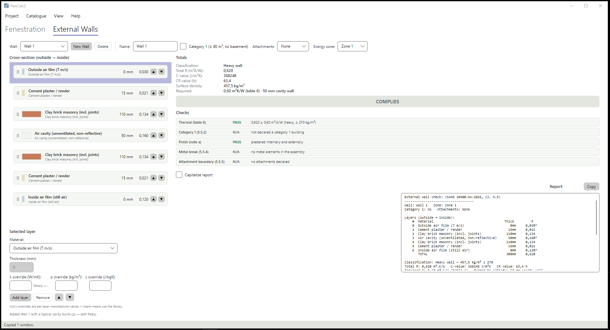

<p align="center">
  
</p>

<h1 align="center">FenCalc2</h1>

<p align="center">
  Fenestration solar-gain calculations for <strong>SANS 10400-XA</strong><br>
  Windows and Linux desktop application · MIT licensed
</p>

---

FenCalc2 is a desktop tool that calculates the window (fenestration) figures needed for a
SANS 10400-XA thermal-compliance calculation: glazing area per window type, the
window-to-floor-area ratio, U-values, solar heat gain for each orientation of the building,
and conductance totals — all delivered as a plain-text report you can paste into your own
documents.

<p align="center">
  
</p>
<p align="center"><em>The fenestration tab: your plan image in the middle, windows listed on the
eight compass directions, the selected window on the right, and the report underneath.</em></p>

<p align="center">
  
</p>
<p align="center"><em>The External Walls tab: the layer build-up, the totals and the cl. 5.5
checks for the selected wall.</em></p>

**Who it is for:** architectural professionals, building-energy consultants and students who
already work with SANS 10400-XA.

**What you need to know first:** U-value, SHGC (g-value), window-to-floor-area ratio,
climate zones, and the P and G values used in the shading expression. FenCalc2 performs the
arithmetic — it does not teach the standard. If those terms are unfamiliar, read
**SANS 10400-XA: The design of buildings for thermal comfort** before you start.

> **A note on checking your work.** FenCalc2 does the arithmetic quickly, so you can spend
> your time on the judgement calls. Give its output the same pass you would give any
> spreadsheet — inputs against SANS 10400-XA and your manufacturer's tested data — before it
> goes into a submission. Provided as-is under the MIT licence, without warranty.

## Features

- **Compass plan view** — eight direction tiles around your floor-plan image; tap a tile to
  add a window there, click a window card to edit it.
- **Two standards editions** — the report follows SANS 10400-XA:**2026** (per-storey
  Table 4 bands with area-weighted U-value and SHGC verdicts, shading check P ≥ H × M)
  or SANS 10400-XA:**2011** (the classic constants/solar-gain/conductance report).
  Each building stores its own edition; new buildings default to 2026.
- **External walls** — an *External Walls* tab beside the fenestration view (any
  edition — each building carries its own energy zone): colour-coded, drag-reorderable
  layer assemblies with South African material defaults and per-layer manufacturer
  overrides; totals (R, C-value, CR, surface density) and the cl. 5.5 checks — tables
  6/7 per energy zone, finish, metal break, category 1, attachment boundary — with
  their own copyable report.
- **Floor-plan images per floor** — click the centre box, pick a png/jpg/bmp; the app copies
  it into its own data folder.
- **Rotate and mirror** — shift the direction ring with the buttons or the mouse wheel,
  re-anchor it with the Orientation selector, or mirror the whole building left-to-right.
  **Flip Image** flips only the picture — the button reads *Unflip Image* while the plan
  image is shown mirrored, so it is never flipped behind your back.
- **Window catalogue** — ranges and window types with glazing/frame U-values and SHGC, plus
  manufacturer-tested overrides.
- **Multi-storey buildings** — add, duplicate, rename and delete floors; per-floor areas and
  plans; copy windows across floors and directions.
- **Editable windows** — change type, size, side, floor, glass, frame, P/G, U and SHGC, then
  Apply Changes.
- **The output** — per-floor report with areas, ratio, constants, solar heat gain per
  direction and conductance totals; copy it to the clipboard and paste into a **monospace
  font** (Consolas / Courier New) so the columns line up.
- Light, dark and five accent themes.

The in-app **Help > Getting Started** guide walks through the whole workflow, including a
worked example of creating a top-hung aluminium range.

## Example output

The report follows the building's standard edition. Paste it as plain text into a
**monospace** font (Consolas, Courier New) and the columns line up. Full text versions are
saved as [`docs/example-fenestration-2026-output.txt`](docs/example-fenestration-2026-output.txt),
[`docs/example-walls-output.txt`](docs/example-walls-output.txt) and (legacy)
[`docs/example-output.txt`](docs/example-output.txt).

### SANS 10400-XA:2026 report

```text
FENESTRATION CALCULATIONS: (SANS 10400-XA:2026)
-----------------------------
STANDARD: SANS 10400-XA:2026 (EDITION 3), CL. 5.1-5.3
CLIMATE ZONE: ZONE 1
TOWN: PRETORIA   LATITUDE: 25,744°S
SHADING MULTIPLIER M = 0,40

GROUND FLOOR:
FLOOR AREA: 187,00
PT912     : 2 x 0,900 x 1,200 = 2,160
PT99      : 4 x 0,900 x 0,900 = 3,240
PTT1215   : 10 x 1,200 x 1,500 = 18,000
PTT1515   : 3 x 1,500 x 1,500 = 6,750
TOTAL     : 30,150

WINDOW TO FLOOR AREA RATIO: 30,150 / 187,00 * 100 = 16,12%
TABLE 4 BAND: ≤ 20 %   MAX U: ANY   SHGC SHADED: ANY   UNSHADED: ANY   SOUTHERN: ANY
WEIGHTED U-VALUE (19 UNITS): 7,900  (ANY)
WEIGHTED SHGC — UNSHADED (12): 0,810  (ANY SOLUTION)
WEIGHTED SHGC — SOUTHERN (7): 0,810  (ANY SOLUTION)
SHADING (5.2.2): P ≥ H × M, M = 0,40
  PTT1215    NORTH      P  375 vs H × M =  1660 × 0,40 =   664 → UNSHADED
  PTT1215    EAST       P  375 vs H × M =  1660 × 0,40 =   664 → UNSHADED
  PTT1215    NORTH EAST P  375 vs H × M =  1660 × 0,40 =   664 → UNSHADED
  PTT1215    NORTH EAST P  375 vs H × M =  1660 × 0,40 =   664 → UNSHADED
  PTT1215    NORTH EAST P  375 vs H × M =  1660 × 0,40 =   664 → UNSHADED
  PTT1215    NORTH EAST P  375 vs H × M =  1660 × 0,40 =   664 → UNSHADED
  PTT1215    NORTH EAST P  375 vs H × M =  1660 × 0,40 =   664 → UNSHADED
  PTT1215    NORTH EAST P  375 vs H × M =  1660 × 0,40 =   664 → UNSHADED
  PT912      NORTH WEST P  375 vs H × M =  1360 × 0,40 =   544 → UNSHADED
  PT912      NORTH WEST P  375 vs H × M =  1360 × 0,40 =   544 → UNSHADED
  PT99       NORTH WEST P  375 vs H × M =  1060 × 0,40 =   424 → UNSHADED
  PT99       NORTH WEST P  375 vs H × M =  1060 × 0,40 =   424 → UNSHADED
PRIMARY FACADE (5.1): NORTH EAST
STOREY RESULT: COMPLIES

NOTES:
 - WHOLE-ELEMENT U/SHGC PER ANSI/NFRC 100/200 (5.3.2/5.3.3); CENTRE-OF-GLASS VALUES NOT USED.
 - AIR LEAKAGE OF WINDOWS/DOORS/ROOFLIGHTS PER SANS 613 (5.3.8).
 - ONE OCCUPANCY PER STOREY ASSUMED (5.3.6); MULTI-TENANCY NEEDS PER-TENANCY NFA.

BUILDING RESULT: COMPLIES
```

### External wall check (cl. 5.5)

```text
External wall check: (SANS 10400-XA:2026, cl. 5.5)
------------------------------------
Wall: Wall 1   Zone: Zone 1
Category 1: no   Attachments: None

Layers (outside → inside):
    #  Material                                     Thick         R
    0  Outside air film (7 m/s)                        0mm     0,030*
    1  Cement plaster / render                        15mm     0,021
    2  Clay brick masonry (incl. joints)             110mm     0,134
    3  Air cavity (unventilated, non-reflective)      50mm     0,160*
    4  Clay brick masonry (incl. joints)             110mm     0,134
    5  Cement plaster / render                        15mm     0,021
    6  Inside air film (still air)                     0mm     0,120*
       TOTAL                                         300mm     0,620

Classification: Heavy wall — 457,5 kg/m² ≥ 270
Total R: 0,620 m².K/W   C-value: 368248 J/m²K   CR value: 63,4 h
Required R: 0,60 m².K/W (table 6)   deemed-to-satisfy: 50 mm cavity wall

Checks:
  Thermal (table 6)              PASS    0,620 ≥ 0,60 m².K/W (heavy, ≥ 270 kg/m²)
  Category 1 (5.5.2)             N/A     not declared a category 1 building
  Finish (note a)                PASS    plastered internally and externally
  Metal break (5.5.4)            N/A     no metal elements in the assembly
  Attachment boundary (5.5.5)    N/A     no attachments declared

Result: COMPLIES
```

### Legacy 2011 report

Exactly what the Output panel produces for a small single-storey building on the 2011
edition:

```text
FENESTRATION CALCULATIONS:
-------------------------
CLIMATE ZONE: ZONE 1

FLOOR AREA: 69,58

FENESTRATION AREA:
PT159    : 1 x 1,500 x 0,900 = 1,350
PT69     : 2 x 0,600 x 0,900 = 1,080
PTT1515  : 4 x 1,500 x 1,500 = 9,000
SD1821XO : 1 x 1,800 x 2,100 = 3,780
TOTAL:                        15,210

WINDOW TO FLOOR AREA RATIO: 15,210 / 69,58 * 100 = 21,86%

CONSTANTS:
CONDUCTANCE: 69,58 X 1,2  = 83,496
SHG        : 69,58 X 0,15 = 10,437

SOLAR HEAT GAIN: (AREA X SHGC X SOLAR E FACTOR)
NORTH EAST:
3 x PTT1515 : P/H = 375/1755 = 0,214 : 6,750 x 0,810 x 0,770 = 4,210
SOUTH EAST:
PT69        : P/H = 375/1155 = 0,325 : 0,540 x 0,810 x 0,590 = 0,258
SOUTH WEST:
PTT1515     : P/H = 375/1755 = 0,214 : 2,250 x 0,810 x 0,820 = 1,494
PT69        : P/H = 375/1155 = 0,325 : 0,540 x 0,810 x 0,750 = 0,328
NORTH WEST:
SD1821XO    : P/H = 375/2355 = 0,159 : 3,780 x 0,810 x 0,970 = 2,970
PT159       : P/H = 375/1155 = 0,325 : 1,350 x 0,810 x 0,800 = 0,875
TOTAL:                                                        10,135

CONDUCTANCE:
PT159    : 1 x 1,350 x 7,900   = 10,665
PT69     : 2 x 0,540 x 7,900   =  8,532
PTT1515  : 4 x 2,250 x 7,900   = 71,100
SD1821XO : 1 x 3,780 x 7,900   = 29,862
TOTAL:                          120,159
```

The `2 dec` / `3 dec` radios, `Capitalize` and `Combine floors` checkboxes change the
formatting (`Combine floors` applies to 2011 reports — a 2026 report is always assessed
storey by storey); `Copy to Clipboard` puts the whole block on the clipboard.

## Getting started (short version)

1. **Catalogue** — a fresh install ships with a starter catalogue (7 glazing types, 5 frame
   materials, the climate-zone tables and 5 window ranges with their types). Upgrading from
   the classic FenCalc? Use *Catalogue > Import Old Database* (Windows only).
2. **New project** — *Project > New Project*: client, project, building, climate zone and
   the orientation at the top of your plan. A Ground Floor is created for you.
3. **Plan image** — click the centre box of the compass and pick your drawing.
4. **Line up the building** — Orientation selector, Rotate buttons / mouse wheel,
   Mirror Building, and Flip Image to flip just the picture.
5. **Add windows** — tap a compass tile, right-click > *Add Window Here*, or the
   *Add Window…* button.
6. **Edit** — click a window card, change anything, *Apply Changes* (use `Orient` or `Floor`
   to move it).
7. **Copy the output** — *Copy to Clipboard*, paste as plain text in a monospace font.

## Download

Grab the archive for your platform from the
[**Releases**](https://github.com/pietsnyman/fencalc2/releases) page:

| Platform | Archive | Run it |
|---|---|---|
| Windows x64 | `FenCalc2-<version>-win-x64.zip` | Unzip, double-click `FenCalc2.exe` |
| Linux x64 | `FenCalc2-<version>-linux-x64.tar.gz` | Unpack, run `./FenCalc2-<version>-linux-x64/FenCalc2` |

- **Self-contained** — no .NET runtime or any other dependency needs to be installed.
- **Nothing is installed** — both archives are portable, no admin rights required.
- On first launch the database, its migrations and the starter catalogue are created
  automatically (see [Data and databases](#data-and-databases)).
- Verify the download against `SHA256SUMS.txt` (`sha256sum -c SHA256SUMS.txt`).
- Windows SmartScreen may warn that the unsigned executable is unrecognized: *More info* >
  *Run anyway*, if you trust the source.

Optional — put it in your Linux application menu by pointing `Exec` at wherever you
unpacked it:

```ini
# ~/.local/share/applications/fencalc2.desktop
[Desktop Entry]
Type=Application
Name=FenCalc2
Comment=SANS 10400-XA fenestration calculations
Exec=/path/to/FenCalc2-<version>-linux-x64/FenCalc2
Icon=fencalc2
Categories=Utility;
```

## Building from source

Requirements: the [.NET 9 SDK](https://dotnet.microsoft.com/download/dotnet/9.0).

```bash
dotnet build FenCalc2.sln        # 0 warnings expected
dotnet run --project FenCalc2.csproj
```

## Publishing a standalone build

Self-contained builds run without the .NET runtime installed:

```powershell
# Windows: produces publish/win-x64 and publish/linux-x64
./publish.ps1
# or one platform only
./publish.ps1 -WindowsOnly
./publish.ps1 -LinuxOnly
```

Or natively on Linux:

```bash
dotnet publish FenCalc2.csproj -c Release -r linux-x64 --self-contained -o publish/linux-x64
./publish/linux-x64/FenCalc2
```

`publish/win-x64/FenCalc2.exe` is the Windows application;
`publish/linux-x64/FenCalc2` is the Linux binary (no installer needed on either — unpack
and run).

> The legacy *Import Old Database* feature uses a Windows-only SQLite component and is
> disabled elsewhere with a status-bar message. Everything else works on both platforms.

### Publishing a release

Pushing a version tag builds the same archives in CI (`.github/workflows/release.yml`),
attaches them to a GitHub release with notes and checksums, and publishes it:

```bash
git tag -a v1.1.0 -m "FenCalc2 1.1.0"
git push origin v1.1.0
```

A manual *Run workflow* dispatch builds the archives without creating or changing any
release.

## Data and databases

| | |
|---|---|
| **Windows** | `%LOCALAPPDATA%\FenCalc2\Data\FenCalc2.db` (+ `Images\`) |
| **Linux** | `~/.local/share/FenCalc2/Data/FenCalc2.db` (+ `Images/`) |

- The database is a plain SQLite file, **created and migrated automatically the first time
  you start the application** — there is nothing to install or configure, and no admin
  rights are needed.
- It carries **no password**. (The only password in the codebase opens the *old* FenCalc
  database during a legacy import; that file is never distributed.)
- On a fresh install the curated catalogue seed (`Data/seed/catalogue.sql`) is applied
  automatically so the app is usable immediately.
- The SANS 10400-XA:2026 reference values (`Data/seed/xa2026.sql`) are re-applied at every
  start-up, so data corrections reach existing databases.
- Your floor-plan images are copied next to the database, so the original files stay where
  they are.
- Set the `FENCALC2_DB_PATH` environment variable to point the application at a different
  database file (used for testing).

## Repository notes

- `LegacySqlite/` holds the codec-enabled net46 `System.Data.SQLite` pair (public domain,
  taken from the original FenCalc application's packages). It is required to build the
  legacy import and must not be removed.
- The logo and exe icon are generated, not hand-edited: `python tools/make_logo.py`
  (needs [Pillow](https://pypi.org/project/Pillow/)).
- The catalogue seed is generated from a curated database with
  `python tools/export_seed.py <db>`.
- The 2026 reference seed is generated with `python tools/import_sans2026.py` from a
  licensed copy of SANS 10400-XA:2026. It carries numeric reference values only — table
  values and the annex C town list — and the licensed source text is not part of this
  repository.
- No database, floor-plan image or project data is stored in this repository.

## Licence

[MIT](LICENSE) — Copyright (c) 2026 Piet Snyman.

SANS 10400-XA is a publication of the SABS and is not included with or affiliated with this
project. The reference data in `Data/seed/xa2026.sql` consists of derived numeric values
only — table values and the annex C town list. The text of the standard is neither included
nor redistributed; obtain the standard from the SABS to check the values against it.
